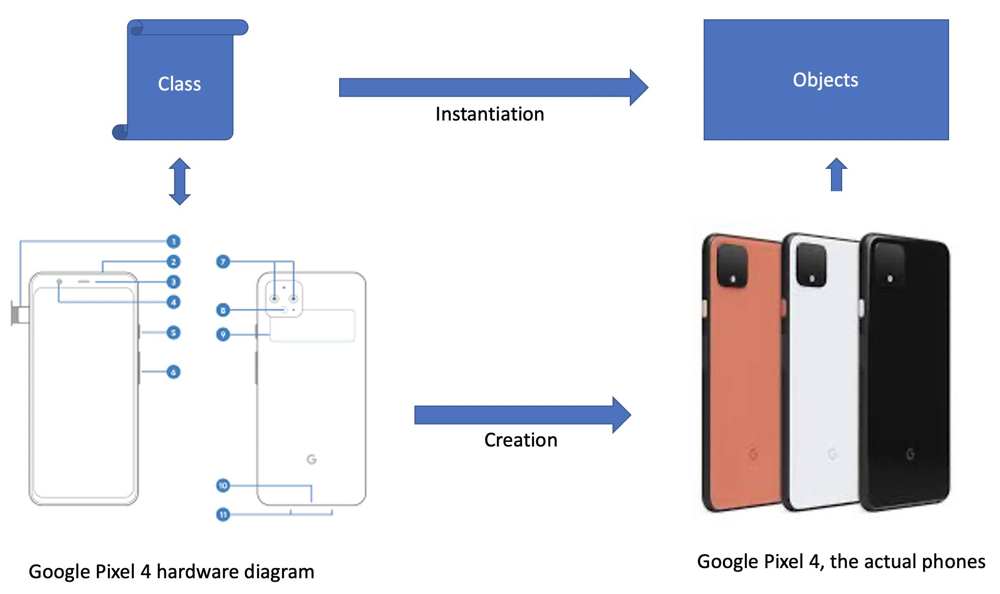
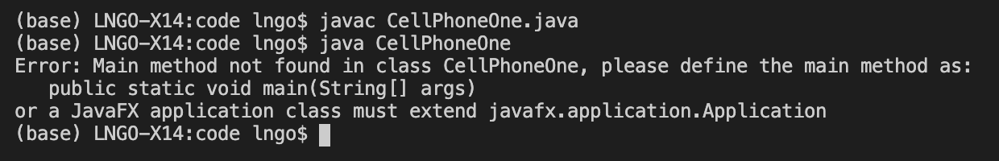
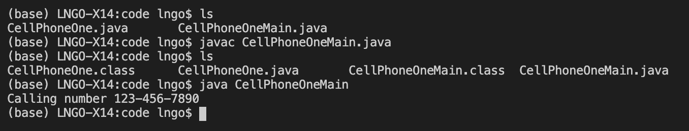

# Definitions

- A **class** is a segment of code in which programmers define attributes and behaviors of *a thing*. One could think of class as a blueprint of *that thing*. 
- When the program runs and needs to create an instance of *this thing*, this instance is called an **object** and will be instantiated from the descriptions written in the class code. Another term instead of **object** is **instance**. 

> ## How many objects per class:
> It should be noted that multiple objects can be instantiated from a class. 
> We can relate to the analogy above in how multiple phones can be produced 
> based on a single diagram. 
{: .callout}

- Going back to the phone diagram/phone analogy, we can infer that a detailed phone diagram will provide information about the phone's characristics such as color, dimension, weight. Some of these characteristics are fixed (e.g., all Pixel 4 will have the same dimension/weight), and some can be changed (e.g., phones 
can have different colors). These characteristics are called **fields** or **instance fields**. They can also be called **attributes**. In literature,
you can also see them referred to as **class variables**. 
- An even more detailed technical phone diagram will tell you what this phone can do for you. For example, you can use the phone to call other people, take picture, surf the web, watch movies, etc. These actions, or **functions**, are called **methods**. 

> ## Understanding aspects of class and object:
> Jane and Joe bought their house in a newly developed neighborhood. 
> They werefirst represented with a catalog of house models, where they picked
> the house they want to build. They also specified technical details like 
> the color of the front door, carpet or hardwood floor, color of window sashes. 
> After sometimes, the house was built. On their first evening at the house, Jane
> and Joe turned on the front porch's lights and had a drink outside to celebrate. 
>
> Match the following items in the above paraphraph with their corresponding class/object
> analogy:
> 1. catalog of house models
> 2. front door color
> 3. number of house lights
> 4. turning on house lights
>
> > ## Solution
> >  1. This is a class definition. It defines how a house should be built in the neighborhood. 
> >  2. This is a class attribute. 
> >  3. This is also a class attribute. 
> >  4. This is a class method. An action that 
> {: .solution}
{: .challenge}

# Class Definition and Declaration/Instantiation

The source code belows defines a simple cell phone, called CellPhoneOne class. Lines 6 and 7 defines
the two fields of CellPhoneOne, and lines 13 through 15 defines method callNumber() of CellPhoneOne. 
If you compile and attempt to run CellPhoneOne.class, nothing really happens because there was no
*main()* method. `CellPhoneOne.java` simply contains the definition of CellPhoneOne. 

This next source code will declare, instantiate, and manipulate an object of type CellPhoneOne. Line 6 **declares**
a variable named `aPhone` of type CellPhoneOne. Line 7 **instantiates** an object (instance) from class CellPhoneOne,
then assigns this object to variable `aPhone` declared earlier. Lines 8 through 11 show how the fields of `aPhone`
are manipulated, and line 12 shows how method `callNumber` is called. 

When `CellPhoneOneMain.java` is compiled, it requires `CellPhoneOne.java` to be in the same directory, and the 
compilation process will create the `.class` files for both. You can now call `java CellPhoneOneMain` and see
the only output resulting from `callNumber`. 

The above programs are not really useful (or sensible) for a number of reasons. Aside from the fact that there
are way to few attributes and functionalities, one item that does not make sense is the fact that the external program (*CellPhoneOneMain*)
can modify the attributes such as dimensions and colors! From a common sense perspective, those attributes are
fixed once a phone is created (**instantiated**). This brings us to our next lecture on Constructors, private versus public, 
and static versus non-static. 


