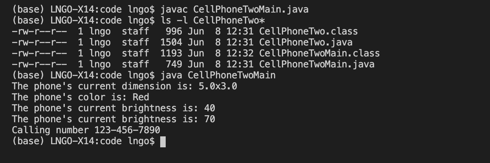
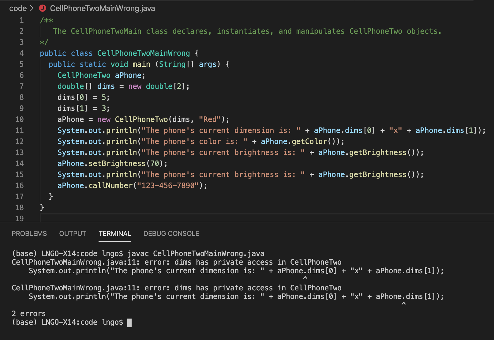

Let's revisit our CellPhoneOne code. From the previous lecture, we realize that
the way that code is setup does not make intuitive sense. The physical attributes
should be assigned specific values as the CellPhoneOne object is instantiated. 
This brings up a number of expanded definitions: public and private fields/attributes.

# Public and Private

A(n) field/attribute in a class must be either public or private. A **public** field can 
be accessed and modified by method/operation from outside of the class' definition. A **private**
field can only be accessed/modified from within the class' definition. Similarly, a **public** 
method is a method that can be called from outside of the class' definition, while a **private** 
method can only be called from inside the class definition.

Analogically speaking, let's think about the brightness setting of a cell phone. It is 
possible to change the strength of electrical currents from inside the phone such that 
the light emittors on the screen increase/reduce their intensity. It is not possible 
to do that *directly*. Therefore we need that sliding function on the phone so that 
we can adjust the phone's brightness via this function. In this case, brightness is a 
**private attribute** that can be manipulated by a method controllable externally (the slider), 
which means that it is a **public method**. 

In another analogy, let's think about iPhone's performance throttling incident, where 
older iPhones automatically slowdown when their battery degrade. Battery level, battery life, 
and CPU performance are all internal measureable attributes of a cell phone. To throttle
the performance (e.g., reduce CPU speed), there must be an internal function/method that
evalutes battery level and battery life and then throttles the CPU accordingly. This is 
an example of a **private method** manipulating **private attributes**. 

In most cases, a class' methods use that class' private attributes for specific purposes. 
However, there are two types of special methods whose purposes are quite straightforward:
to present the current value of a private attribute to the outside world and to change the 
current value of a private attribute to a new value given by the outside world. The former 
is called a **mutator** method and the latter is called an **assessor** method. 

# Constructors

In `CellPhoneOneMain.java`, line 7 instantiates the object from its class definition. In 
other words, the `aPhone` object is created from class `CellPhoneOne`. Relating this back 
to the real world, we know that once something is physically created from a blueprint, its
characteristics are now materialized and in some sense, measurable. The creation of a cell
phone from a blueprint, therefore, is an involved process. We could certainly do the same
thing with our object instantiation process through the help of **constructors**. 

A **constructor** is a special method that is called when an object of a class is created/instantiated. 
The constructor contains codes that help initilizing the object's attributes. 

# Example

The cell phone example is updated in `CellPhoneTwo.java`. In this example, all class attributes are 
now private (lines 7 through 9). Line 16 through 20 defines the constructor for `CellPhoneTwo`. Within
this constructor, the values for the class attributes are initialized. In lines 17 through 19, values on 
the right side of the assignment sign (`=`) come from the constructor's arguments. These are values are
assigned to the class attributes, which are on the left side of the assignment sign. Comparing to `CellPhoneOne`,
`CellPhoneTwo` has four new methods: `setBrightness`,`getBrightness`,`getColor`, and `getDims`. These methods
help manipulating and accessing values of `CellPhoneTwo`'s **private** attributes. Since the methods
are all public methods, users can leverage these methods to interact with these attributes. 

The four methods can be classified into two types: **assessor** and **mutator**. 
- Assessor methods' names typically have the form `getXYZ` with `XYZ` is the name of the attribute 
being accessed. Assessor methods will return the current value of the attribute being accessed. 
Assessor methods do not take any argument, and the return types of assessor methods should be the same as 
those of the attrubites being accessed. For example, `getColor` returns color (lines 42-44), `getDims` 
returns dimension array (line 50-52), and `getBrightness` returns brightness (lines 34-36).  
- Mutator methods' names typically have the form `setXYZ` with `XYZ` is the name of the attribute being
modified (mutated). Mutator methods typically do not return anything (`void`) or return a `Boolean` 
value to indicate whether the mutation process has been successful (`True`) or not (`False`). Mutator 
methods require an argument of the same type as that of the attribute being modified/mutated. The value
from this argument will be used to replace the current value of the attribute. In `CellPhoneTwo`, only 
attribute *brightness* has a corresponding mutator methods (`setBrightness`, lines 26-28). This method requires an 
argument of type integer (line 26). The value of this argument will then be assigned to attribute *brightness* 
(line 27). Attributes *color* and *dims* are fixed after initial creation of a `CellPhoneTwo` object, so no
mutator method is needed. 

> ## Understanding assessors and mutators:
> Determine whether any of the following statements is True or False
>
> 1. Assessor methods are used to modify the values of object's private attributes. 
> 2. Mutator methods are used to return the values of object's private attributes. 
> 3. All private attributes must have their corresponding assessor methods.
> 4. All private attributes must have their corresponding mutator methods. 
>
> > ## Solution
> >  1. False. Assessor methods are used to return the values of object's private attributes. 
> >  2. False. Mutator methods are used to modify (mutate) the values of object's private attributes.  
> >  3. False. Only private attributes need to be viewed/accessed from outside the object need to have assessor methods.  
> >  4. False. Only private attributes need to be modified from outside the object need to have mutator methods.  
> {: .solution}
{: .challenge}

We modify `CellPhoneOneMain.java` to create `CellPhoneTwoMain.java`. In this second version, the dimension array is created
prior to the creation of the `CellPhoneTwo` object. This array and the **Red** string become parameters for `CellPhoneTwo`'s
constructor (line 10). Line 11 through 15 show various usage of `CellPhoneTwo` assessors and mutators to interact with its 
private attributes (*dimensions*, *color*, and *brightness*).

The figure below presents the steps to compile and run `CellPhoneTwoMain.java` and the resulting outcomes. 

> ## Observing errors from trying to interact with private attributes without using assessors or mutators:
> A major goal of object-oriented programming is to provide isolation. In other words, this ensures the integrity of
> the object and that internal information (attributes) should only be manipulated intentionally (via assessors and 
> mutators) and not accidentally (via direct modification of public attributes). 
>
> In the following exercise, try modifying `CellPhoneTwoMain.java` to interact with the attributes directly. Observe
> the errors. 
> 
> > ## Solution
> > In this example, we try to access the *dims* private attribute directly instead of using an assessor (line 11). The 
> > Java compiler recognizes this problem and prevents use from being able to compiled. It should be noted that there 
> > are two errors reported since we try this direct access approach twice. From the screenshot, you can see how the 
> > error indicators show two different errors on the same line (line 11).
> >
> >  
> >  
> {: .solution}
{: .challenge}

## Static methods

Methods within a class can either have a `static` in front of their names or not, immediately after 
the `public`/`private` flag. A method with the `static` flag can be invoked without object
 instantiation. For example, methods carrying out common mathematical calculation provided by Java's 
 builtin Math class are all static. These methods can be found at [the page containing Math's source code](http://hg.openjdk.java.net/jdk8/jdk8/jdk/file/687fd7c7986d/src/share/classes/java/lang/Math.java).

In the above example, the `sqrt` method is invoked to calculate the square root of variable `x` that has a value of 16. Because this method belongs to the Math class, to invoke it, you will have to also specify the class that contains the method: `Math.sqrt(x)` (line 7). 


