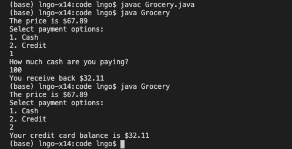

> ## 1. Overloading Methods and Constructors
>
> Imagine a grocery store. Customers checking out of a grocery store can 
> have at least three different ways to pay. They can pay by cash (`numeric`). 
> They can also pay by credit card (`object`). These different types of payment 
> represent an analogy to the concept of **overloading** in object oriented 
> programming. In other words, you can **overload** a constructor/method so that 
> this constructor/method can have multiple definitions with the same name but 
> with different parameters. 
>
{:.slide}

> ## 2. Hands-on: Cashier.java 
>
> - `Cashier.java` defines a **Cashier** class that implements two `payment` methods. 
> - The first `payment` method (lines 2-4) accepts two arguments of type double, 
> representing the cash amount and the price and returning the difference. 
> - The second `payment` method (lines 6-7) accepts a `CreditCard` object and a double, 
> then debits the dboule (representing price) against the balance inside the `CreditCard` object. 
>
> 
>
> - Compile `Cashier.java` and try to test run. 
>
{:.slide}

> ## 3. Hands-on: CreditCard.java
>
> - `CreditCard.java` defines **CreditCard** class that has a private *balance* and public methods 
> to `debit`, `credit`, and return the balance using `getBalance`. 
>
> 
>
> - Compile `CreditCard.java` and try to test run. 
>
{:.slide}

> ## 4. Hands-on: Grocery.java
>
> - `Grocery.java` represent the main application. This class declares and initializes a 
> `price` variable of type double and value **67.89**. The `main` method declares and 
> initializes a `Cashier` object, prints out the price (line 8), displays a menu 
> (lines 9 through 11), and read user input regarding payment method (line 12). 
> - If the payment is cash (line 13), users are asked to enter the amount of cash (line 15). 
> Next, the `Cashier` object calls a `payment` method. This is the first definition of `payment`. 
> Depending on whether the difference is positive or negative, different messages are printed out 
> (lines 17-21). 
> - If the payment is credit card (line 22), a new `CreditCard` object is declared and intialized 
> with a balance of $100. The `Cashier` object invokes `payment` again, this time the second 
> definition of payment is implied due to the nature of the method's arguments. We use the 
> `CreditCard` object to print out the balance of the credit card. 
>
> 
>
> The compilation and running of `Grocery.java` is shown below. 
>
> 
>
> Overloading is applicable for **constructors** as well. For example, in [the API of the Scanner class webpage](https://docs.oracle.com/javase/8/docs/api/java/util/Scanner.html#constructor.summary)> , we can see how different Scanner objects can be instantiated/constructed using 
> different constructors, each of which depends on the source being scanned. 
>
{:.slide}


