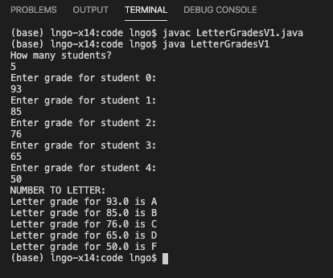

# Introduction to Arrays

Until now, we have used variables representing individual entities (cost, interest, principle, grade ...) when program. In reality, we often see individual entities of the same nature being grouped together for convenient. For example, you can buy a carton of a dozen eggs, a 6-pack of beers, or package of 24 water bottles.

When referring to these entities, we often referring to an entire group as a single unit. Imagine the following scenario:

~~~
Alice: Bob, don't forget to grab some eggs when you are at the supermarket.
Bob: Sure, how many?
Alice: Two.
~~~

Do you think Alice is asking Bob to pick up two eggs? Most certainly not. Bob is going to pick up two cartons of eggs. There can be some discussion about whether they contain 12 or 18, but not two eggs!

> ## Definitions
> - A general term for data items being grouped together is **data structure**. 
> - An **array** is a data structure used to store a fixed number of data items of same type.
> - The total number of data items is fixed and is called the **length** or the **size** of the array.
> - All data items are of the same types, and this is called the **base type** (or **type**) of the array.
> - In an array, each data item can be referred to by its **index** (position number).
> - The starting position of the first data item is **0**. Therefore, an array of **N** items will have first item at index **0** and the last item at index **N - 1**.
{: .callout}

# Array Declaration

The syntax to declare an array is as follows:

```
BASE_TYPE[] ARRAY_NAME;
```

For example, to declare an array containing data items of type double, one can type the following:

```
double[] myArray;
```

The array is declared to be named `myArray` and contains data items of type `double`. However, it is not ready to store data items yet. To do so, the array must be initialized.

# Array Initialization

Let's say we want to store numeric grades of 10 students in myArray. The required initialization can be done as follows:

```
myArray = new double[10];
```

In some cases, if you know the sizes of the array before hand, declaration and initialization can be merged into a single statement:

```
double[] myArray = new double[10];
```

Similarly, if you know the entire content of the array before hand, declaration, initialization, and assignment of values can be merged into a single statement:

```
String[] myVeggies = new String[]{"asparagus","broccoli","cucumber","dill"};
```

# Accessing and manipulating data items in an array

When data items are grouped into an array, they loose their individuality! There is no individual variable names for data items in an array. To access the values of these items, we use a combination of the array name and the index value. For example:

Given the following array: 

```
String[] myVeggies = new String[]{"asparagus","broccoli","cucumber","dill"}
```

To refer to broccoli, we would use `myVeggies[1]`.

> ## Array accessing practice:
> 
> Given the following array, 
> ```
> String[] mySport = new String[]{"Aerobics","Basketball","Cricket","Diving"}
> ```
> What value will each of the followings return?
>
> 1. mySport[2]
> 2. mySport[1]
> 3. mySport[0]
> 4. mySport[3]
>
> > ## Solution
> >  1. Cricket 
> >  2. Basketball 
> >  3. Aerobics 
> >  4. Diving
> {: .solution}
{: .challenge}


# Example

 Let's look at the following `LetterGrades.java` source code that accepts numeric 
 grades for ten students from user input, then converts them to letter grades based on 
 WCUPA's grading scheme. 

<script src="https://gist.github.com/linhbngo/d4dcf56c9d764b7f444e1452fcddc045.js?file=LetterGrades.java"></script>

A number of limitations exist in this source:
- What if we want to enter grades for more than 10 students. To that end, each 
  course can have a different number of students. 
- Is there a way to reduce the number of codes responsible for number-to-letter conversion?

The above limitations can be managed using array. One implementation approach is shown in 
the source code of `LetterGradesV1.java`. 

<script src="https://gist.github.com/linhbngo/d4dcf56c9d764b7f444e1452fcddc045.js?file=LetterGradesV1.java"></script>

- Line 5 declares a variable of type `int` called `studentCount`, which is then initialied
  by a user-entered value via a Scanner object. 
- Lines 6-7: `studentCount` allows two arrays, `numGrades`/**double** and `grades`/**String** 
  to  be declared and initialized. These two arrays will contain the students' numeric grades and corresponding letter grades, respectively. 
- Lines 8-9: `numWCUPA` and `letterWCUPA` are **double** and **String** arrays that store the    
  lower bound numeric value of a grade-range and the corresponding letter grades, respectively. 
- Lines 10-13: This loops iterates through the value of `studentCount`, starting at `0` and  
  ending at `studentCount - 1`. These are the indices for the elements inside numGrades. Each 
  iteration of the loop will ask for a user input value to be assigned to the corresponding 
  element in the `numGrades` array (line 12).
- Lines 15-24: This loops iterates through the value of `studentCount`, starting at `0` and  
  ending at `studentCount - 1` again. Each iteration will go to the element at the corresponding 
  indice in arrays `grades` and `numGrades`. We start out setting `grades[i]` to **F**. The nested loop from lines 17-22 iterates through the length of `numWCUPA` array. The representing variable is `j`. On line 18-21, tf the student's numeric grade (`numGrades[i]`) is greater than the lower bound of WCUPA's numeric grade range (`numWCUPA[j]`), the student's letter grade (`grades[i]`) is set to the value of the corresponding WCUPA's letter grade (`letterWCUPA[j]`). When this happens, the nested loop will also be terminated. If the nested loop runs to 
  completion and the condition in the if statement (line 18) is never **True**, it means that the student's grade is lower than 60, and the initial "F" value for letter grade remains unchanged. 
- Line 23 prints out the numeric and corresponding letter grade of the students. 

The figure below shows the compiling and running process for `LetterGradesV1.java`. 





