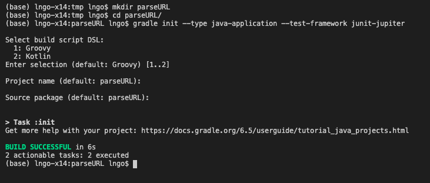
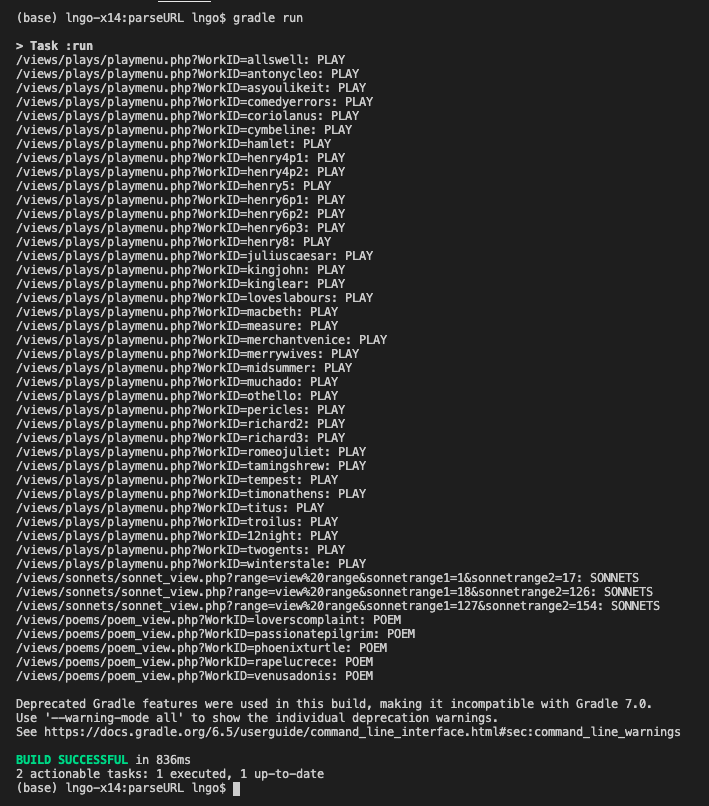

Array (the concept) is the most basic data structure (*just line things up!*) in programming and 
can be used to organized  both primitive and complex objects. 

> ## Problem Statement
> We wish to mine information about Shakespeare's life work, including titles, 
> types, and length (of plays) from an online site. The list of tasks include:
> - Mine list of work from original URL and classify work as plays, sonnets, or poems. 
> - Refine/augment list of work to include full titles. 
> - Based on classification, construct URL to individual play and mine for work length. 
{: .prereq}

# Array of Strings

In `URLParser.java`, we carry out the first task of mining the URL of the online site, 
extract information about Shakespeare's work, and classify individual work into play, sonnets, or poems. 

<script src="https://gist.github.com/linhbngo/d4dcf56c9d764b7f444e1452fcddc045.js?file=URLParser.java"></script>

> ## Code Reading Practice:
> 
> Going over the above source code line by line. 
>
> > ## Solution
> >  - Line 4: Package name 
> >  - Line 6-10: Java imports
> >  - Line 12: Class name - `URLParser`
> >  - Line 44: Main function
> >  - Line 45: Declare variable `baseURL` of type String. Assign the string "http://www.opensourceshakespeare.org" to this variable. 
> >  - Line 46: Declare variable `workList` as an array of Strings. Assign the return value of method `getWork` to this variable. Method `getWork` use `baseURL` (declared and initialized in 46) as its argument. 
> >  - Line 26: Define method `getWork` as a public and static method, which takes in a String as a parameter and return an array of String. 
> >  - Line 27: Declare a variable `results` as an array of Strings and initialize `results` to 
> **null** value. 
> >  - Line 28-40: A try-catch block for `IOException`. The library **Jsoup** uses Java IO mechanism to read online data. Therefore, we have to anticipate and catch any possible `IOException`. 
> >  - Line 29: Declare a variable `doc` of type `Document` (a class in Jsoup library). `Document` represents HTML/XML objects. Variable `doc` is initialized to the content acquired from the link `url` (Parameter of `getWork`). 
> >  - Line 31: The values of attribute `href` from HTML elements in `doc` that have HTML tags containing the HTML attribute `class='sidebarworks` are collected and assigned to a single variable named `links` of type `Elements` (a class in Jsoup library).
> >  - Line 32: Initialize variable `results` (declared in line 28) to an array of Strings whose size is the same size of `links`. 
> >  - Line 33-36: A **for** loop that iterates through each item of `links`. 
> >  - Line 34: Assign the element of links (at each iteration) to a variable named `bElem` of type `Element` (note the difference: `Element` and `Elements`). 
> >  - Line 35: Convert the value of the link stored in `bElem` to String and assign this string to the item in the `results` array that has the same index as the corresponding item in the `links` list. 
> >  - Line 37: Return `results`. This will terminate the method. 
> >  - Line 41: If an exception happens (Line 38 will not be invoked), we still need to return variable `results`. In this case, the returned value is **null**. 
> >  - Line 47: Call method `getType` with argument is variable `workList` (line 46), which contains the returned array of Strings from `getWork`. 
> >  - Line 14: Define method `getType` as a public and static method, which takes in an array of String as a parameter. `getType` does not return anything (void). 
> >  - Line 15-23: A **for** loop that iterates through each item in the array of Strings. 
> >  - Line 16: Check if the item at the current iteration contains the string "plays".
> >  - Line 17: If the condition in 16 is True, print out the item and the string ": PLAY". 
> >  - Line 18: Check if the item at the current iteration contains the string "sonnets".
> >  - Line 19: If the condition in 16 is True, print out the item and the string ": SONNETS". 
> >  - Line 20: If the item contains neither "plays" nor "sonnets". 
> >  - Line 21: Print out the item and the string ": POEM". 
> {: .solution}
{: .challenge}

To run the above code, we need to use gradle. This helps managing the inclusion of `jSoup`. 
Run the following commands. For `gradle`, keep hitting Enter to accept all default answers. 

```
$ mkdir parseURL
$ cd parseURL
$ gradle init --type java-application --test-framework junit-jupiter
```


Modify `build.gradle` to contain the followings:

```
plugins {
    id 'java'
    id 'application'
}

repositories {
    mavenCentral()
}

dependencies {
    implementation 'com.google.guava:guava:29.0-jre'
    compile 'org.jsoup:jsoup:1.10.2'
    testImplementation 'org.junit.jupiter:junit-jupiter-api:5.6.2'
    testRuntimeOnly 'org.junit.jupiter:junit-jupiter-engine:5.6.2'
}

application {
    mainClassName = 'parseURL.URLParser'
}

test {
    useJUnitPlatform()
    testLogging {
        events "passed", "skipped", "failed"
        exceptionFormat = "full"
    }
}
```

Comment out lines 11 and 12 inside `AppTest.java`. 
To run the program, type `gradle run` inside the terminal and hit **Enter**. 




# Array of Objects

Instead of simply using an array of Strings to store all work, an additional 
class called `Work.java` is created. Class `Work` represents individual work 
and has three attributes: `title`, `url`, and `type`. It also has the 
corresponding asessor and mutator methods for each of the attributes. 

<script src="https://gist.github.com/linhbngo/d4dcf56c9d764b7f444e1452fcddc045.js?file=Work.java"></script>

Class `ExtendedURLParser.java` leverages `Work` to acquire and display more information. 
Intead of using an array of Strings to store only the partial links to the individual work, 
`ExtendedURLParser` uses an array of `Work`. When contents are extract from the base URL, both 
title and partial URL of each work are used as arguments in the instantiation of an object of type `Work`. 

<script src="https://gist.github.com/linhbngo/d4dcf56c9d764b7f444e1452fcddc045.js?file=ExtendedURLParser.java"></script>

> ## Code Reading Practice:
> 
> Indentify the differences between `ExtendedURLParser.java` and `URLParser.java`. 
>
> > ## Solution
> >  - Line 46: Declare variable `workList` as an array of `Work` objects instead of an array of Strings.  
> >  - Line 30: Declare a variable `results` as an array of `Work` objects and initialize `results` to **null** value. 
> >  - Line 35: Initialize variable `results` (declared in line 28) to an array of `Work` objects. 
> >  - Line 38: The item ranked `b` in the `results` array is assigned a `Work` object that has been instantiated with the text of the title and the partial URL as constructor arguments. 
> >  - Line 37: Return `results`. This will terminate the method. 
> >  - Line 50: Call method `getType` with argument is variable `workList`, which contains the returned array of `Work` objects from `getWork`. 
> >  - Line 14: Define method `getType` as a public and static method, which takes in an array of `Work` objects as a parameter. `getType` does not return anything (void). 
> >  - Line 15-23: A **for** loop that iterates through each item in the array of `Work` objects. 
> >  - Line 16-21: The over ideas are the same, but asessor and mutator methods are used to access and modify title and type attributes of individual `Work` objects. 
> {: .solution}
{: .challenge}

# Two dimensional arrays

To know the length of each play, we can (naively) multiply the number of acts and the number of scenes in each act. In other word, we need to mine and store this information. 


