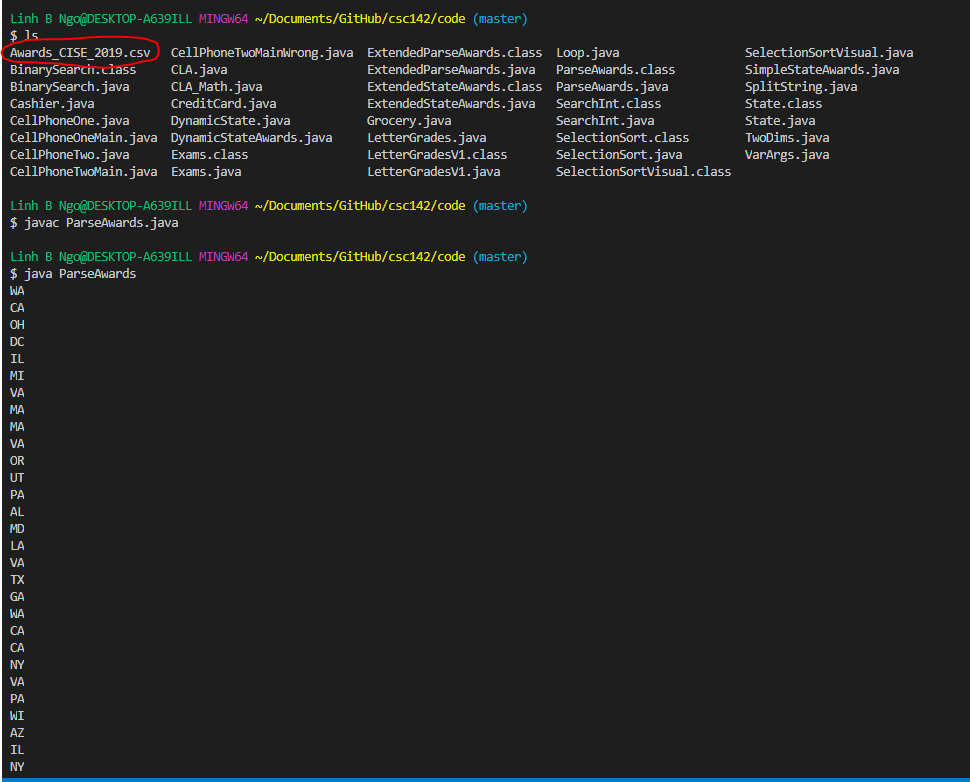
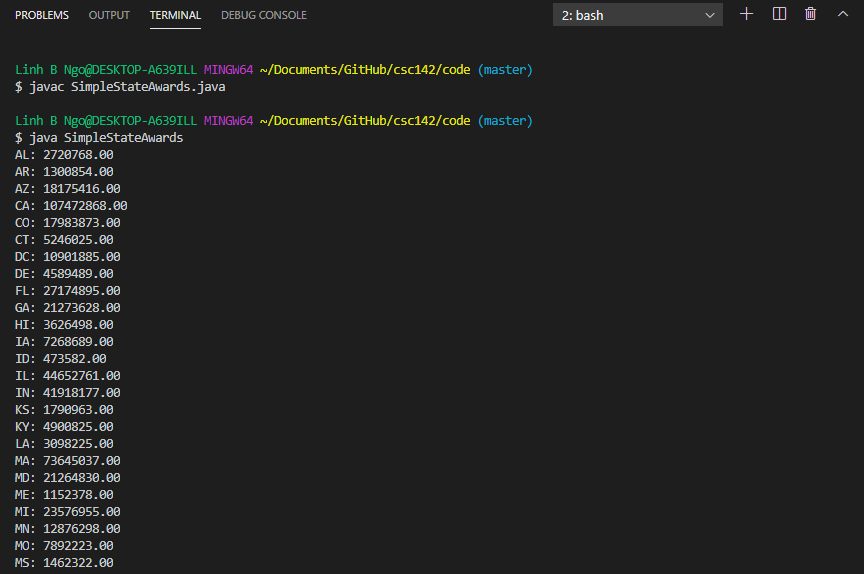

Array (the concept) is the most basic data structure (*just line things up!*) in programming and 
can be used to organized  both primitive and complex objects. 

> ## Problem Statement
> We wish to study how many awards, and how much money, have been granted to Pennsylvania
> from National Science Foundation (NFS)'s Directorate of Computer and Information Science
> and Engineering (CISE) in 2019. The file `Awards_CISE_2019.csv` contains all awards from 
> CISE. The first line is the header line. The header represents the relevant fields of an 
> an award, including AwardNumber, Title, NSFOrganization, Program(s), StartDate, 
> LastAmendmentDate, PrincipalInvestigator, State, Organization, AwardInstrument, 
> ProgramManager, EndDate, AwardedAmountToDate, Co-PIName(s), PIEmailAddress, 
> OrganizationStreet, OrganizationCity, OrganizationState, OrganizationZip,
> OrganizationPhone, NSFDirectorate, ProgramElementCode(s), ProgramReferenceCode(s),
> ARRAAmount, Abstract. The data (string) in each field is enclosed in double quotes, and
> separated by a comma. 
> - Mine the list of all states that received awards in 2019. 
> - Refine/augment list of work to include award titles. 
> - Include additional information per award, including the amount of money. 
{: .prereq}

# Array of Strings

In `ParseAwards.java`, we carry out the first task of mining the URL of the online site, 
extract information about Shakespeare's work, and classify individual work into play, sonnets, or poems. 

> ## Code Reading Practice:
> 
> Going over the above source code line by line. 
>
> > ## Solution
> >  - Line 1-2: Java imports
> >  - Line 4: Class name - `ParseAwards`
> >  - Line 5: Main function
> >  - Line 6-12: Scope of `try` 
> >  - Line 7: Create a `BufferedReader` object using the *relative path* to data file `Awards_CISE_2019.csv`. Assign this object to variable `br`.
> >  - Line 8: Declare a String variable named `current`, initialized to `null`. 
> >  - Line 9: While `current`, *which is assigned the value of `br.nextLine()` call, is not `null`. 
> >  - Line 10: The string `current` is splitted using `","` as token. This is due to the characteristics of data line in the file. The resulting array of Strings is assigned to variable `award` of type array of Strings.  
> >  - Line 11: The eigth element of the `award` variable (`award[7]`) is printed out.  
> >  - Line 13-15: The `catch` portion in the case we have an IOException error. 
> {: .solution}
{: .challenge}

In running the above code, besides creating the `ParseAwards.java` file, we must also download [Awards_CISE_2019.csv][awards-cise-2019] and store this 
file in the same directory as the Java file. 

> ## Code Correction:
> 
> There is a logical error with `parseAwards.java`. What is it, and how do you fix it? 
>
> > ## Solution
> >  - The `State` header is included in the results. 
> >  - Run `nextLine()` once prior to the `while` loop to ommit the header row. 
> {: .solution}
{: .challenge}

To further improve on `parseAwards.java`, we can redesign it so that `main()` is simplified and the heavy work is moved into another function. This is 
shown `ExtendedParseAwards.java`. 

> ## Code Reading Practice:
> 
> Going over the above source code line by line. 
>
> > ## Solution
> >  - Line 1-2: Java imports
> >  - Line 4: Class name - `ExtendedParseAwards`
> >  - Line 45: Main function
> >  - Line 47: Static method `stateListBR` is invoked with argument is the name of the data file (same-directory assumption). The returned value of this method call will be assigned to variable fundedStates of type array of Strings. 
> >  - Line 6: Declaration of method `stateList` with parameter is a String contains the path to the file. 
> >  - Line 7: Assign an empty String to variable states of type String. 
> >  - Line 8-17: Scope of `try` 
> >  - Line 9: Create a `BufferedReader` object using the *relative path* to data file `Awards_CISE_2019.csv`. Assign this object to variable `br`.
> >  - Line 10: Have `br` invokes `readLine()` once to omit the header line. 
> >  - Line 11: Declare a String variable named `current`, initialized to `null`. 
> >  - Line 12: While `current`, *which is assigned the value of `br.nextLine()` call, is not `null`. 
> >  - Line 13: The string `current` is splitted using `","` as token. This is due to the characteristics of data line in the file. The resulting array of Strings is assigned to variable `award` of type array of Strings. 
> >  - Line 14: If `states` does **not** already contain the eigth element of the `award` variable (`award[7]`),
> >  - Line 15: Append `award[7]` and a space to `states`.  
> >  - Line 18: Return the result of a split call on `states` using a single space (`" "`) as token. 
> >  - Line 19-21: The `catch` portion in the case we have an IOException error. 
> >  - Line 22: If an exception happens, a `null` value will be returned. 
> >  - Line 48-50: Iterate through elements of `fundedStates` using `i`, with `i` iterates from 0 to a value less than the length of the `fundedStates` array. 
> >  - Line 49: Print out the element at index ith of `fundedStates`.  
> {: .solution}
{: .challenge}

# Array of Objects

To store additional information on each individual states, we will need to create a `State` class (`State.java`). 

Class `ExtendedState.java` leverages `State` to acquire and display more information. 
Intead of using an array of Strings to store only the partial links to the individual work, 
`ExtendedState` uses an array of `State`. Several rounds of reading through the data file were carried out.

> ## Code Reading Practice:
> 
> - What does the first round of reading through the data file do? 
> - How many times did the code read through the data file in total?
> 
> > ## Solution
> >  - Identify the unique states that have awards included in the data files.   
> >  - The number of data file read-through is equal to the number of unique states in the data files plus one.
> {: .solution}
{: .challenge}

> ## Code Modification Practice:
> 
> - How can we make the total amount fully printed out in non-scientific format (more readable)?
> 
> > ## Solution
> >  `System.out.printf("%s: %08.02f\n", fundedStates[i].getName(), fundedStates[i].getSum());`
> {: .solution}
{: .challenge}

# Two dimensional arrays

`ExtendedStateAwards.java` can be simplified if we only want to keep track of the number of awards and the total 
amount awarded per state. It can be done by leveraging a two dimensional array. A two dimensional array is declared 
using two pairs of square bracket. For example `int[][] oneArray` declares a variable `arrayOne` of type two-dimensional 
array of `int`. As the syntax suggested, all elements of a two-dimensional array must be of the same type. A 
two-dimensional array is somewhat similar to an Excel spreadsheet in that it represents a row/column data structure. 
The first bracket pair maintainsindex for the number of rows, and the second bracket pair maintains index for the 
number of columns. 

An example of a simple two-dimensional array is shown in `TwoDims.java`.

> ## Code Modifiction Practice:
> 
> - Can you augment TwoDims so that it prints out a transposed version of `oneArray`
> 
> > ## Solution
> >   `System.out.print(oneArray[j][i] + " ");`
> {: .solution}
{: .challenge}

> ## Code Reading Practice:
> 
> - What are the difference between `SimpleStateAwards.java` and `ExtendedStateAwards.java`?
> 
> > ## Solution
> >  - Changes in usage of two-dimensional variable `statesReport` versus usage of array of `State` objects `awardedStates`.
> {: .solution}
{: .challenge}

           

