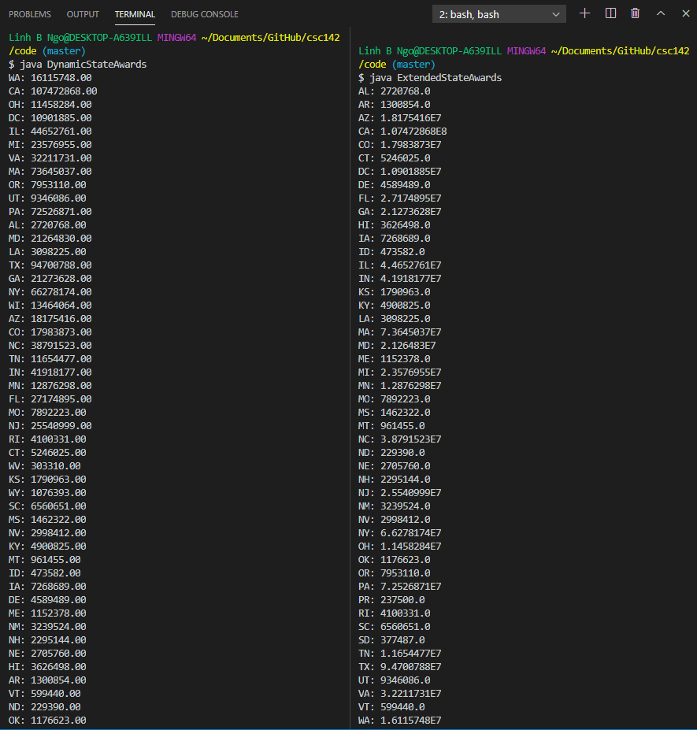

# Command-Line Arguments

The `main` method (if availalble) inside a Java class accepts an array of Strings arguments. These arguments come from contents provided
when users execute the `java` command to run the class. For example, given the following `CLA.java` program:

<script src="https://gist.github.com/linhbngo/d4dcf56c9d764b7f444e1452fcddc045.js?file=CLA.java"></script>

Compile and run CLA.java with various command line arguments as follows:

```
$ javac CLA.java
$ java CLA
$ java CLA rams
$ java CLA golden rams
$ java CLA golden rams wcupa
$ java CLA golden rams wcupa university
```

The outcomes of the aboev runs are presented in the figure below:


- With `java CLA`, there is no command line arguments. 
- With `java CLA rams`, there is one command line argument: `rams`. 
- Similarly, you will have additional commmand line arguments in the subsequent example commands from above. 

All command line arguments are stored in array of Strings `args`. Therefore, if you intend to provide 
numeric arguments, they will need to be converted from **String** to the appropriate numeric type. This is 
shown in `CLA_Math.java`. 

<script src="https://gist.github.com/linhbngo/d4dcf56c9d764b7f444e1452fcddc045.js?file=CLA_Math.java"></script>

In the example runs below, when a command line argument is in the double format, `CLA_Math` throws a `NumberFormatException`, 
which means that we seem to try to parse a String formatted as **double** into an **int**. 


# Variable-Length Arguments

The `String[] args` parameter of `main` can potentially accept an unlimited number of arguments. This mechanism, 
called **variable-length arguments**, can be applied for other methods as well by using the `...` notation for parameters
in method declaration. 

<script src="https://gist.github.com/linhbngo/d4dcf56c9d764b7f444e1452fcddc045.js?file=VarArgs.java"></script>


Variable-length arguments are to be used in cases where one does not know how many arguments will be provided 
to the method call. In this case, we can either go with **overloading** (which could lead to a lot of codes) or 
use **variable-length arguments**. 

# ArrayList

In the previous lesson, we had to iterate through our data file multiple times to get the counts before declaring 
and initializing arrays. This is inefficient, especially as the data grows. As an alternative, Java provides a class
called ArrayList that supports dynamic arrays that can grow as needed. Additional technical details  
can be found on [ArrayList's API page][array-list].

We reimplement `ExtendedStateAwards.java` as `DynamicStateAwards.java` and `State.java` as `DynamicState.java` using 
ArrayList as follows:

In `DynamicStates.java`, the attributes `titles` and `amounts` are converted from normal array to `ArrayList`. The `<>` 
(angle bracket) notation is called **generic**. The notation `<T>` should be read as `of type T`. Therefore, `ArrayList<String> titles`
should be read as *an ArrayList-of-type-String variable named titles*. This also leeds to changes in  internal mutators. 
Instead of using `setTitle` and `setAmount`, a mutator named `addAward` is now used to **add** new title and awarded amount 
to `titles` and `amount`, respectively.   

<script src="https://gist.github.com/linhbngo/d4dcf56c9d764b7f444e1452fcddc045.js?file=DynamicState.java"></script>

In `DynamicStateAwards.java`, an ArrayList of type DynamicState (`ArrayList<DynamicState>`) is setup to store the states
as they are read in from the data file in one pass. The algorithmic flow of `DynamicStateAwards.java` can be summarized 
as follows:

- Start reading the first data line (omit the header line) and create the first `DynamicState` object to store contents 
on this line. Add the object to the (array)list of states. 
- While there remains lines in the file, read one line and check if the state is already included in the list of states
by looping through the list of states. 
  - If the state is already included, add title and award to the included `DynamicState` object in the list, then break
  out of the state-checking loop. 
  - If the state is not included, creat a new `DynamicState` object, update its title and award, then add it to the list. 

<script src="https://gist.github.com/linhbngo/d4dcf56c9d764b7f444e1452fcddc045.js?file=DynamicStateAwards.java"></script>


> ## Code Comparison:
> 
> Explain the difference in output order from `DynamicStateAwards.java` and `ExtendedStateAwards.java`.
> 

> > ## Solution
> > The difference is due to the order of data read. Hint: Think about how `DynamicStateAwards.java` goes through data lines, then insert state
> > as their appear, versus `ExtendedStateAwards.java` where we go through an alphabetically sorted list of state, then insert titles and awards 
> > into the matching state   
> {: .solution}
{: .challenge}



