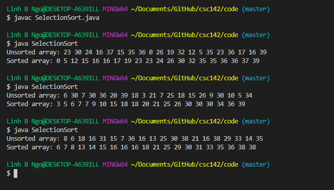
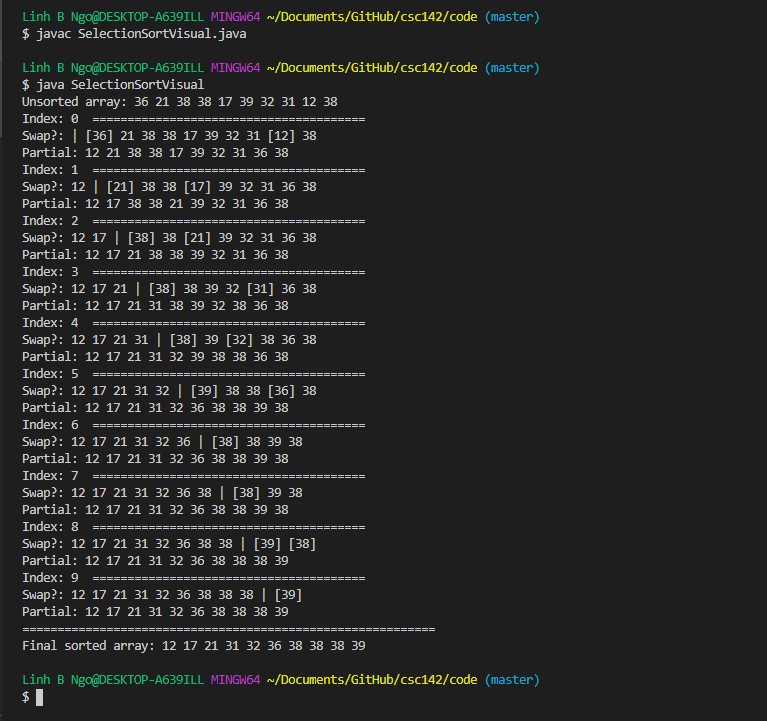

# Sequential Search

We can use a loop to step through an array from the first item, and stop when:
- We find the item of interest, or
- We reach the end of the array. 

> ## Code Modification:
> 
> Create a copy of `SearchInt.java` called `SearchMultiInt.java`. Modify this code such 
> that users can provide multiple command line arguments, 
> and the program will check all these arguments against the elements in `numArray`.
>
> > ## Solution
> >  Use a nested loop ...
> {: .solution}
{: .challenge}

# Selection Sort 

Selection sort is a sorting technique, in which we find the smallest (or largest) element
and place it at the beginning of the array, and then continue to find the second smallest
(or second largest) element and place it at the next position, and so on. Since we are 
*selecting* which element to place into which position as we iterate through all positions
in an array, this is called **selection sort**.

The outcome of this sorting technique is shown below:

To see how this works, `SelectionSort.java` is modified inton `SelectionSortVisual.java`:

# Binary Search

In the real world, When we want to find something, it is always easier to find if the 
surrounding environment is organized. This principle applies to searching/finding data
items in programs: it is easier and faster if the array of data is aleady sorted. 


