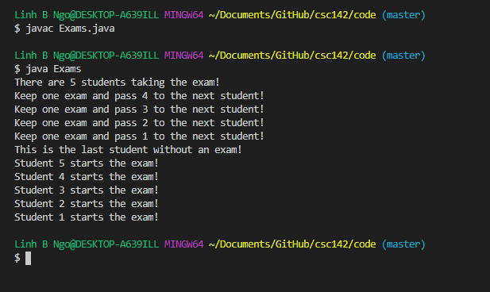
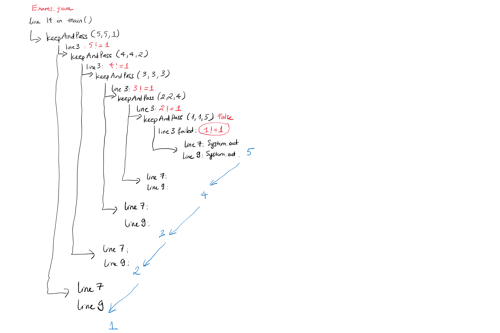
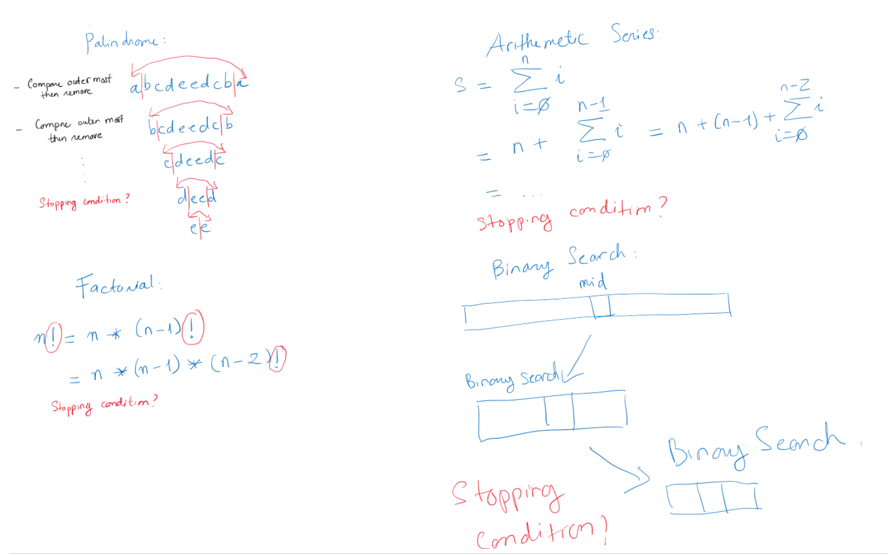

# Introduction to Recursion

Miriam Webster definition: "a computer programming technique involving the user of a 
procedure, subroutine, function, or algorithm that **calls itself one or more time** 
until a specified contition is met at which time the rest of each repetition is processed from the last one called to the first."

> ## A realistic example:
> The class is taking an exam today. The instructor steps into the class and gives a 
> stack of printed exams to the first student at the front row. This student keeps one
> copy and give the rest to the next student. The second student keeps one copy and give
> the rest to the third student and so on. When it gets to the last student, there is 
> no more student without a copy of the exam, and this last student keeps one last copy
> (assuming the number of copies is equal to the number of students). At this point, 
> everyone starts taking the exam. 
{: .callout}

The visual of `Exams.java`'s recursive `keepAndPass` call can be seen below:

> ## Approach to solve a problem recursively:
> - Carry out a few steps of the intended task and identify if
> the problem reduces in size but remain structurally the same. 
> - Identify a **stopping condition**. 
{: .callout}

# Examples of problems solved by recursive methods. 

- Given a string, check if it is a palindrome or not. 
- Calculate factorials of a number. 
- Calculate an arithmetic series. 
- Binary search. 


