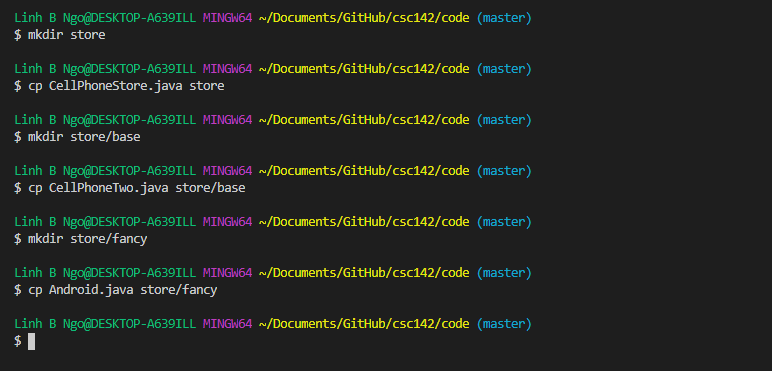
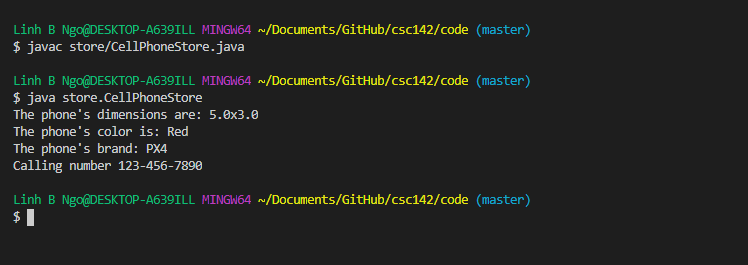
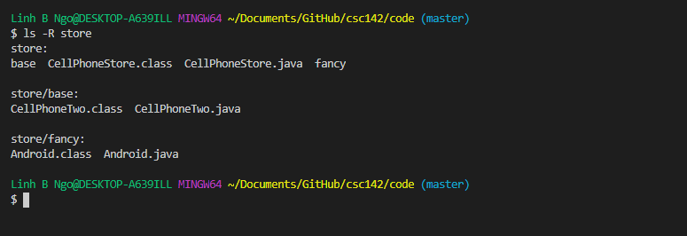

# Inheritance

In object-oriented programming, inheritance allows new classes to be created based on more basic, 
fundamental classes. Let's revisit our cell phone example. A store can sell different brand of 
phones, so there can be a basic `CellPhoneTwo` class with attributes such as `dimensions` 
and `color`. 

<script src="https://gist.github.com/linhbngo/d4dcf56c9d764b7f444e1452fcddc045.js?file=CellPhoneTwo.java"></script>

Based on this `CellPhone` class, we can have additional brand-specific classes such 
as `Android`. This class will **inherit** the attributes and methods of `CellPhoneTwo` and have
additional new attributes and methods specific to itself. 

<script src="https://gist.github.com/linhbngo/d4dcf56c9d764b7f444e1452fcddc045.js?file=Android.java"></script>

- In line 1, we declare a public class `Android` that **extends** `CellPhoneTwo`. `Android` 
is called the **subclass**, while `CellPhoneTwo` is the **superclass**. 
- Lines 2 and 3 are the *new* private attributes of `Android`. 
- Lines 5 through 9 represents the constructor. Even through `Android` only has two attributes, 
its constructor requires 4 attributes. 
- Line 6 calls the **super constructor** - constructor for `Android`'s superclass, `CellPhoneTwo`. 
This will initialize the attributes that this `Android` object inherits from `CellPhoneTwo`. 
- Line 7 and 8 are lines that initialize the attributes that are specific to `Android`. The keyword
**this** refers to the current object. This is to distinguish naming spaces. 

<script src="https://gist.github.com/linhbngo/d4dcf56c9d764b7f444e1452fcddc045.js?file=CellPhoneStore.java"></script>

The `CellPhoneStore` class demonstrates how `Android` objects can be declared/instantiated and how 
these objects can access/invoke attributes and methods inherited from `CellPhoneTwo`. 


# Packaging

- Create a directory called `store`. 
- Copy `CellPhoneStore.java` into `store`. 
- Inside `store`, create a directory called `base`. Copy `CellPhoneTwo.java` into `base`.
- Inside `store`, create a directory called `fancy`. Copy `Android.java` into `fancy`. 
- Add the following lines to the beginning of `CellPhoneStore.java` inside `store`:

```
package store;
import store.fancy.Android;
```

- Add the following lines to the beginning of `Android.java` inside `store/fancy`:

```
package store.fancy;
import store.base.CellPhoneTwo;
```

- Add the following lines to the beginning of `CellPhoneTwo.java` inside `store/base`:

```
package store.base;
```



> ## Directory structures:
> - The keyword `package` represents the location within the directory structure
> that the current class belongs to. 
> - The keyworkd `import` provides the path, from the top of the directory structure
> to the location of the classes that are going to be used in the current class. 
> - To compile and run, you needs to provide the path to the class that contains the
> `main` method. 
{: .callout}

```
$ javac store/CellPhoneStore.java
$ java store/CellPhoneStore
```




- Navigate `store` and you will see the class files being created in the corresponding
directory structure. 





