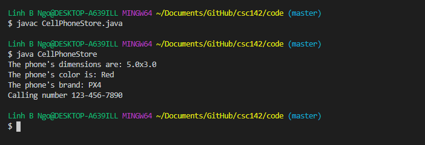
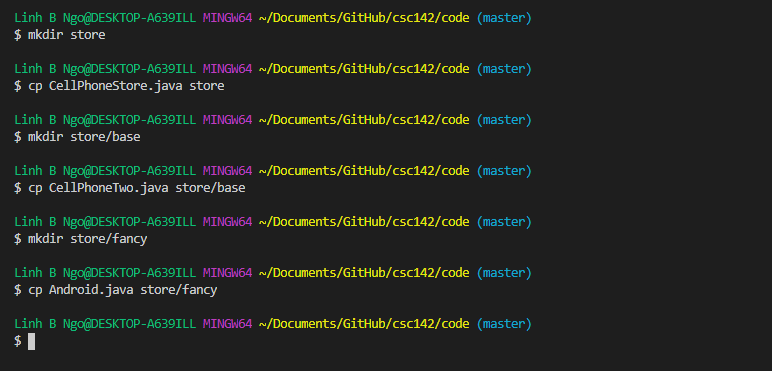
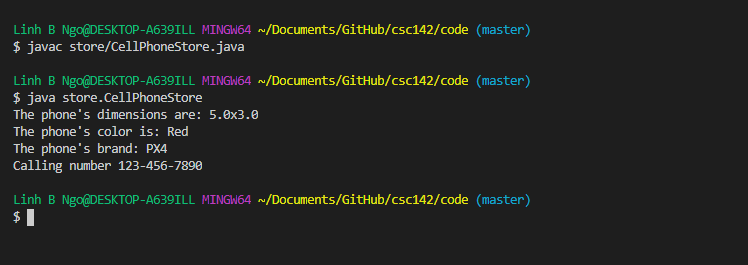
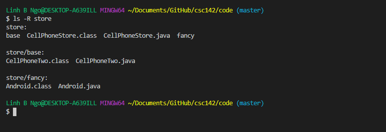

# Inheritance

In object-oriented programming, inheritance allows new classes to be created based on more basic, 
fundamental classes. Let's revisit our cell phone example. A store can sell different brand of 
phones, so there can be a basic `CellPhoneTwo` class with attributes such as `dimensions` 
and `color`. 

<script src="https://gist.github.com/linhbngo/d4dcf56c9d764b7f444e1452fcddc045.js?file=CellPhoneTwo.java"></script>

Based on this `CellPhone` class, we can have additional brand-specific classes such 
as `Android`. This class will **inherit** the attributes and methods of `CellPhoneTwo` and have
additional new attributes and methods specific to itself. 

<script src="https://gist.github.com/linhbngo/d4dcf56c9d764b7f444e1452fcddc045.js?file=Android.java"></script>

- In line 1, we declare a public class `Android` that **extends** `CellPhoneTwo`. `Android` 
is called the **subclass**, while `CellPhoneTwo` is the **superclass**. 
- Lines 2 and 3 are the *new* private attributes of `Android`. 
- Lines 5 through 9 represents the constructor. Even through `Android` only has two attributes, 
its constructor requires 4 attributes. 
- Line 6 calls the **super constructor** - constructor for `Android`'s superclass, `CellPhoneTwo`. 
This will initialize the attributes that this `Android` object inherits from `CellPhoneTwo`. 
- Line 7 and 8 are lines that initialize the attributes that are specific to `Android`. The keyword
**this** refers to the current object. This is to distinguish naming spaces. 

<script src="https://gist.github.com/linhbngo/d4dcf56c9d764b7f444e1452fcddc045.js?file=CellPhoneStore.java"></script>

The `CellPhoneStore` class demonstrates how `Android` objects can be declared/instantiated and how 
these objects can access/invoke attributes and methods inherited from `CellPhoneTwo`. 



# Packaging

- Create a directory called `store`. 
- Copy `CellPhoneStore.java` into `store`. 
- Inside `store`, create a directory called `base`. Copy `CellPhoneTwo.java` into `base`.
- Inside `store`, create a directory called `fancy`. Copy `Android.java` into `fancy`. 
- Add the following lines to the beginning of `CellPhoneStore.java` inside `store`:

```
package store;
import store.fancy.Android;
```

- Add the following lines to the beginning of `Android.java` inside `store/fancy`:

```
package store.fancy;
import store.base.CellPhoneTwo;
```

- Add the following lines to the beginning of `CellPhoneTwo.java` inside `store/base`:

```
package store.base;
```



> ## Directory structures:
> - The keyword `package` represents the location within the directory structure
> that the current class belongs to. 
> - The keyworkd `import` provides the path, from the top of the directory structure
> to the location of the classes that are going to be used in the current class. 
> - To compile and run, you needs to provide the path to the class that contains the
> `main` method. 
{: .callout}

```
$ javac store/CellPhoneStore.java
$ java store/CellPhoneStore
```




- Navigate `store` and you will see the class files being created in the corresponding
directory structure. 




# Abstract classes and abstract methods

> ## Abstract class:
> - Cannot be instantiated, but other classes **extended** it. 
> - An abstract class can serve as a superclass for other classes. 
> 
{: .callout}

> ## Abstract method:
> - Only has declaration and no method body (no `{}`).
> - Is a method that appears in an abstract class and is expected to be overridden in 
a subclass. Failure to do this will result in an error. 
> - **Abstract methods cannot be private!**. This is because they are overridden in subclasses
> , hence they are accessed outside of their original class (superclass) and therefore 
> cannot be private. 
{: .callout}

Let's revisit the cell phone store analogy. It is intuitive to assume that no store 
will sell a brandless CellPhone. Furthermore, it is also possible that each phone 
company has its own way to throttle performance as battery life depreciates over time. 
Perhaps due to differences in design, batter depreciation due to calling activities can
also differ. 

- Create a directory called `second_store`. 
- Inside `second_store`, create a directory called `base`. Create `CellPhone.java` from the source
code below in `base`.
- `CellPhone` is an abstract class.
- `callNumber` and `setCPUSpeed` are abstract methods of `CellPhone`. 

<script src="https://gist.github.com/linhbngo/d4dcf56c9d764b7f444e1452fcddc045.js?file=CellPhone.java"></script>


- Inside `second_store`, create a directory called `fancy`. Create `Galaxy.java` and `iPhone.java` in `fancy` from the source codes below. 

<script src="https://gist.github.com/linhbngo/d4dcf56c9d764b7f444e1452fcddc045.js?file=Galaxy.java"></script>

<script src="https://gist.github.com/linhbngo/d4dcf56c9d764b7f444e1452fcddc045.js?file=iPhone.java"></script>

> ## @Override:
> - `Galaxy` and `iPhone` are subclasses of `CellPhone`.
> - `Galaxy` and `iPhone` have to provide the actual implemtations of `callNumber` and `setCPUSpeed`, 
> the abstract methods of `CellPhone`. The actual implementations differ between `Galaxy` and
> `iPhone`. 
> - The phrase `@Override` is placed on the line just above the declarations of `callNumber` 
> and `setCPUSpeed` in `Galaxy` and `iPhone` to indicate that these are reimplamentation of abstract
> methods. 
{: .callout}

- Inside store, create `SecondStore.java` from the source code below:

<script src="https://gist.github.com/linhbngo/d4dcf56c9d764b7f444e1452fcddc045.js?file=SecondStore.java"></script>

- While both `s3` and `X` perform the same number of calls, because `Galaxy`'s overriding 
implementation of `callNumber` and `setCPUSpeed` differ from those of `iPhone`, the final 
battery values also differ. 

# Interface

- Formal definition: An interface is a class that contains only abstract methods. 
- An interface cannot be instantiated. It must be **implemented** by other classes. 


