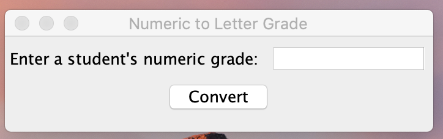
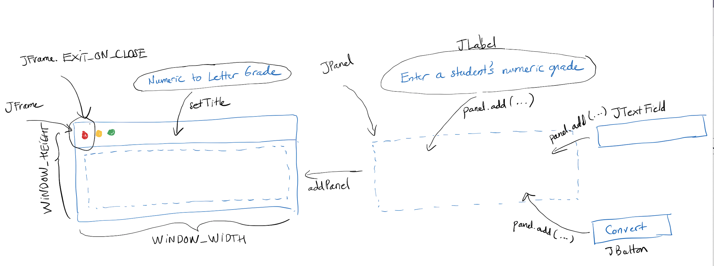
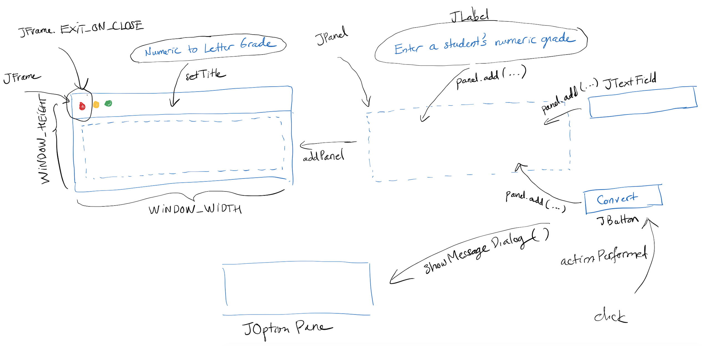

# Overview

A GUI (graphical user interface) allows users to interaction with a program via graphical means (rather than by entering text via the terminal). This involves entering/provide data input and viewing/receiving data output through the interaction of keyboard and/or mouse with various components of the GUI. The components include, but not limited to:
- Label: an area that can display text
- Text field: an area in which users can type a single line of input from the keyboard. 
- Combo box: drop-down list of selections, inncluding user-specific selection via text fields. 
- Check box
- List
- Slider
- Button
- ...

The `GUI1.java` program below represents a simple GUI implementation:

- Line 1 imports the Java Swing library. 
- On line 5 and 6, we set the variable for the width and heigth of the GUI windows. 
- On line 8, we declare and initialize a new `JFrame` object and assign it
to variable `frame`. The frame is created but is not visible. 
- On lines 9, 10, and 11, we set various attributes and behaviors of this frame. 
- On line 12, we now set the frame to be visible. 

The `GUI2.java` program does the same thing as `GUI1.java`, but is organized 
slightly different. Instead of having a separate `JFrame` object in `main`, 
`GUI2` **extends** `JFrame` to be able to initialized as a `JFrame` object. 
The steps to setup the attributes of `JFrame` are done inside the constructor 
of `GUI2`. All `main` does is inializing `GUI2`. 

# Adding components to a GUI

We start with looking at a numeric-to-letter grade conversion problem. Unlike the
previous `LetterGrades.java` example where multiple grades are converted, 
`LetterGrade.java` only convert one grade per run. 

## GUI development

A vanilla implementation of the LetterGrade problem is demonstrated in the source
code below. 

The next figure illustrates the instantiation flow of the process:

## Event-driven programming

outer/inner classes


