> ## To do
> 
> This course requires access to a computing environment that:
>
> - Support Git/GitHub (version control system). 
> - Support Java 11 (or 8). 
> - Support Apache Maven 3+ (a software project management and comprehension tool). 
>
> In the remainder of this page, instructions will be provided for setting up your 
> own computing environment in Windows and Macs.
> 
{: .checklist}

> ## 1. Create a GitHub account
> 
> Regardless of your computing environment, a GitHub account is required for this 
> course. 
> 
> - If you don't have an existing GitHub account, go to 
> [GitHub's Page](https://github.com/) and register for an account with your WCUPA 
> email address. 
> - If you already have an existing GitHub account, go ahead and add your WCUPA email 
> address to your GitHub account as a secondary email. 
>
{: .slide}

> ## 2. Install VSCode
>
> - Go to [Visual Studio Code's download page][vscode] and download the correct package for your computer (Windows, Mac OS, or Linux). 
For Windows, you can download `User Installer 64-bit` version if you only want to install VSCode into your user account. 
>
> - The remainder of this slide uses Windows as a demonstration, but the Mac's installation steps 
> will be similar. 
>
> - Review and accept the License Agreement. 
> 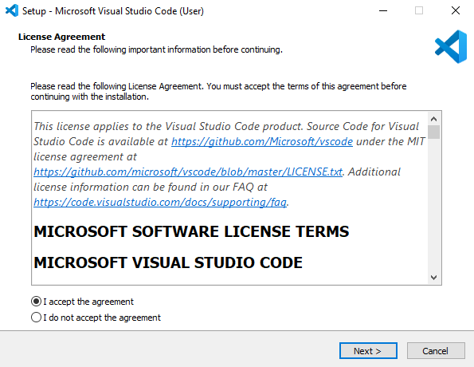
>
> - Review and accept the installation location. In this version, `VSCode` will be installed 
> into a user's home account (click Next). 
> 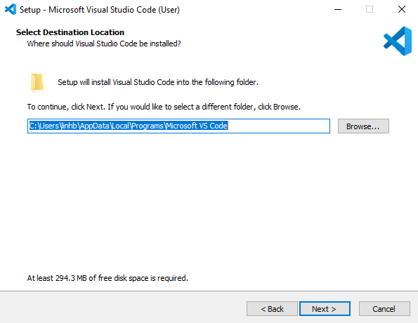
>
> - Confirm the creation of a `Start Menu Folder`.
> 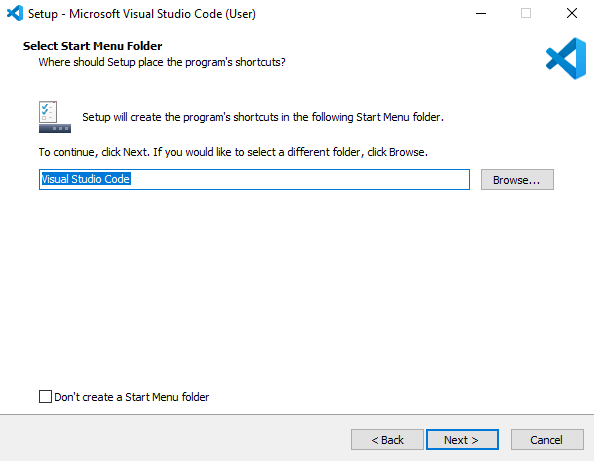
>
> - Confirm the select components match as shown in the screenshot below:
> 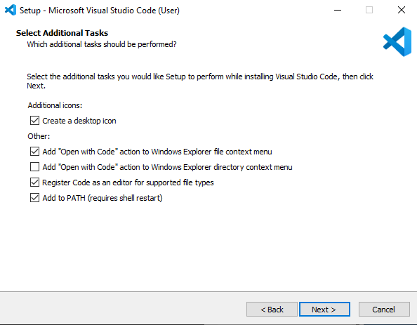
>
> - Review and confirm `Install` (click Next).
> 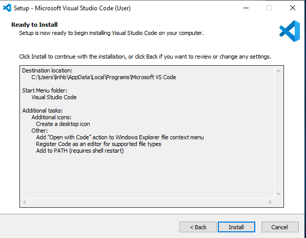
>
> - The installation process is show in the screenshot below. 
> 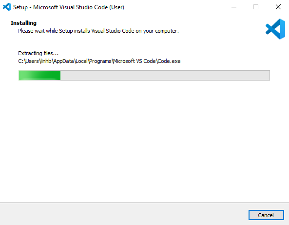
>
> - Click `Finish` when the installation is complete to launch `VSCode`.
> 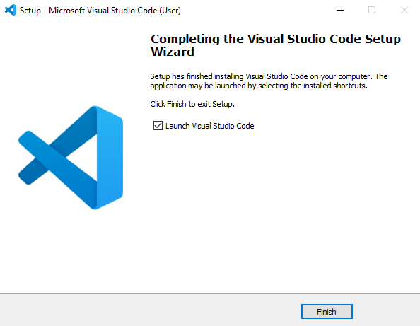
>
> - You can select the initial theme for your `VSCode` during the first launch. 
> 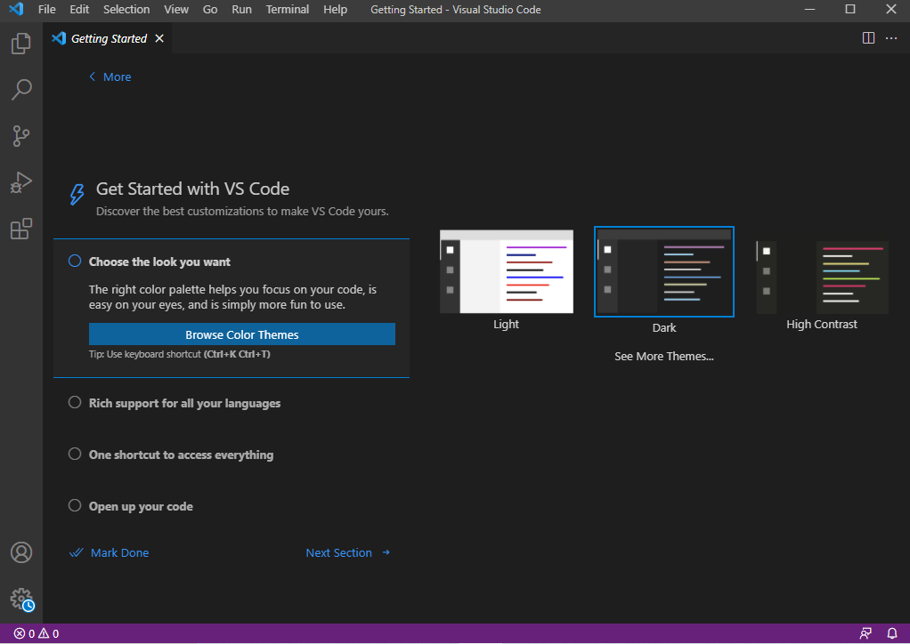
>
{:.slide}

> ## 3. Terminal
> 
> - While Windows and Mac have their own terminal (default PowerShell or Winter Terminal for Windows, and Terminal for Mac), 
> these terminals are integrated into VSCode. 
> - On `VSCode`'s menu bar, select `Terminal`, then `New Terminal`. 
> 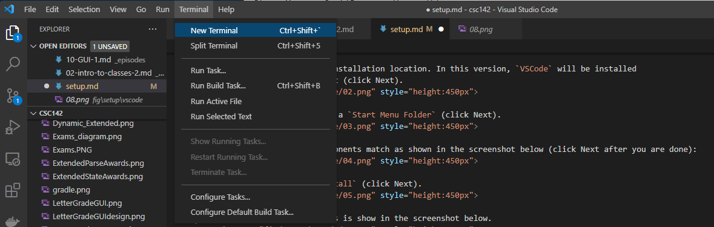
>
> - A terminal will open up at the bottom of the VSCode application. 
>   - The type of terminal can be selected, and a default terminal can be defined in `VSCode`.
> 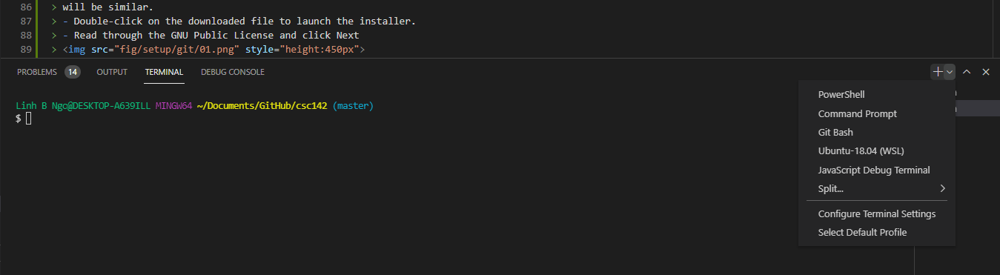
>
{:.slide}

> ## 4. Install Git 
>
> - Go to [Git's download page](https://git-scm.com/downloads) and select the appropriate download
> for your operating system. 
> - The remainder of this slide uses Windows as a demonstration, but the Mac's installation steps 
> will be similar (and/or simpler). 
> - Double-click on the downloaded file to launch the installer. 
> - Read through the GNU Public License and click Next
> 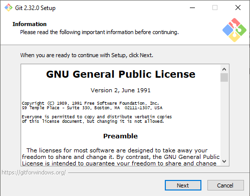
>
> - Review the default installation location and click Next
> 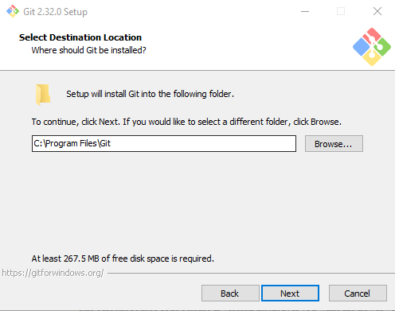
>
> - Confirm the select components match as shown in the screenshot below:
> 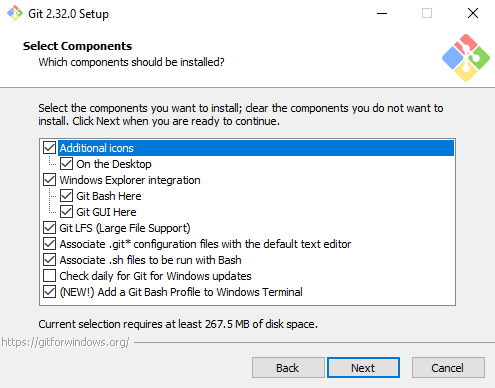
> 
> - Confirm the creation of a `Start Menu Folder`
> 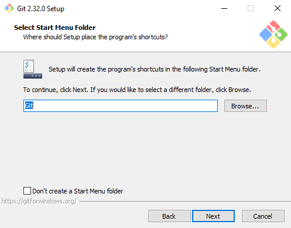
>
> - Select `Visual Code` to the Git's default editor.
>   - If you are comfortable with Git/VSCode and have another editor that you
>   would like to use, feel free to do so. 
> 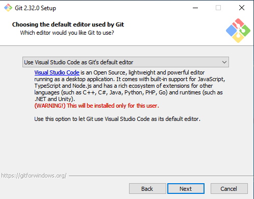
>
> - Confirm the selection of `main` as the default branch name for new repositories. 
> 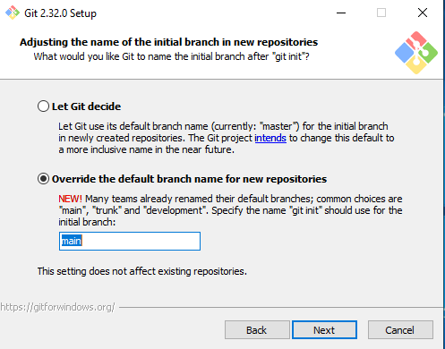
>
> - Confirm that you use the `Recommended` option for setting up PATH environment.
> 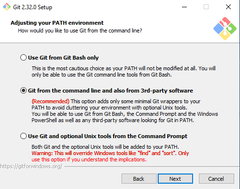
>
> - Confirm `OpenSSL` as the default HTTPS transport backend. 
> 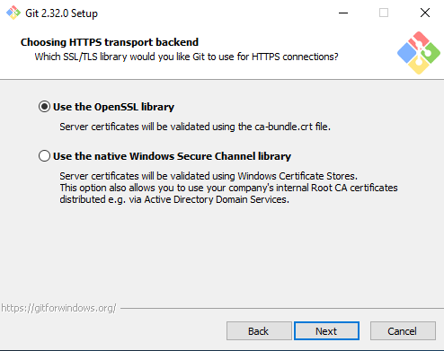
>
> - For `Windows`, select the `Checkout Windows-style, commit Unix-style line endings` option. 
>   - If you are on a Mac, use one of the two remaining options.  
> 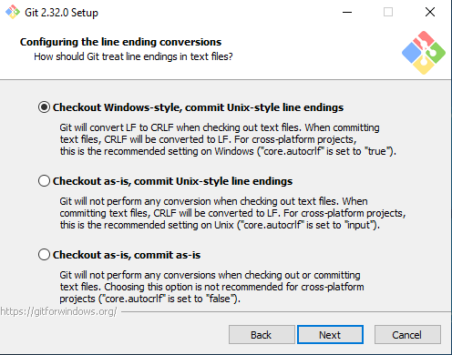
>
> - For the next option, select the `MinTTY` option. 
> 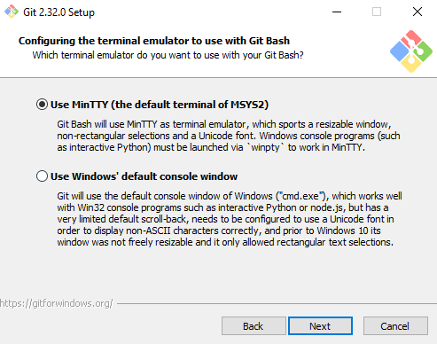
>
> - Confirm the selection of the default `git pull` behavior.
> 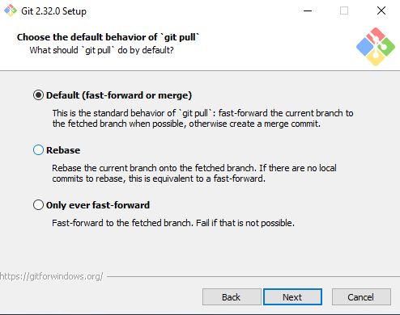
>
> - Confirm the selection of the `Git Credential Manager Core`. 
> 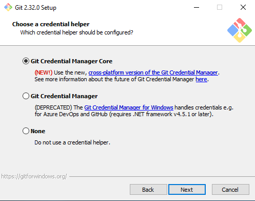
>
> - Select `Enable file system caching`
> 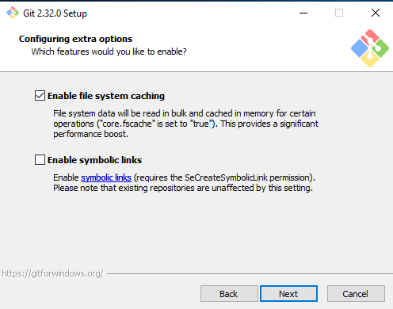
> 
> - You can try to enable the `experimental options`, but I will leave it unchecked here. 
>   - There is a chance that new version of Git will come out and this panel will 
>   not be available. 
> 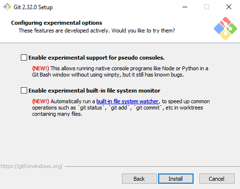
> 
> - After clicking `Install` in the previous step, Git is now installing. 
> 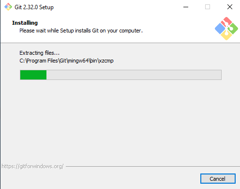
>
> - Click `Finish` to complete the installation process. 
> 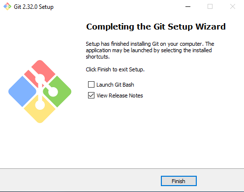
> 
> - We can validate this installation via the terminal in VSCode, 
>   - Open a new terminal in VSCode or relaunch VSCode. 
> - Run the following command:
> 
> ~~~
> $ git --version
> ~~~
> {: .language-bash}
>
> 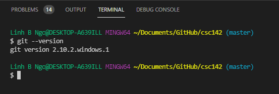
>
{:.slide}

> ## 5. Install Java
>
> It is most likely that you already have Java installed. To confirm this, first,
> open a terminal in VSCode by select **Terminal/New Terminal** on the top Menu bar. 
> Next, run:
> ~~~
> $ java -version
> $ javac -version
> ~~~
> {: .language-bash}
>
> - If you already have Java JDK 8 set up, you can ignore the rest of this `Install Java` step. 
> 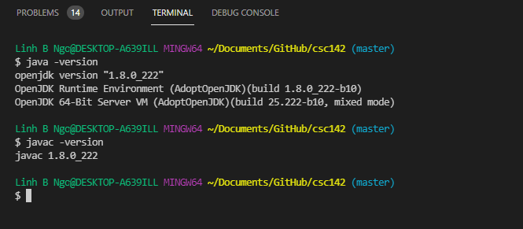
>
> - If you do not have **both** `java` and `javac`, you will need to install Java
> SDK (Software Development Kit). We will be using the Java distribution maintained
> by OpenJDK.
>  - Go to [OpenJDK website](https://adoptopenjdk.net).
>  - Choose **OpenJDK 11 (LTS)** for Version and **HotSpot** for JVM.
>  - Click on the download link to begin download the installation package.
>  - Run the installer. 
> 
> 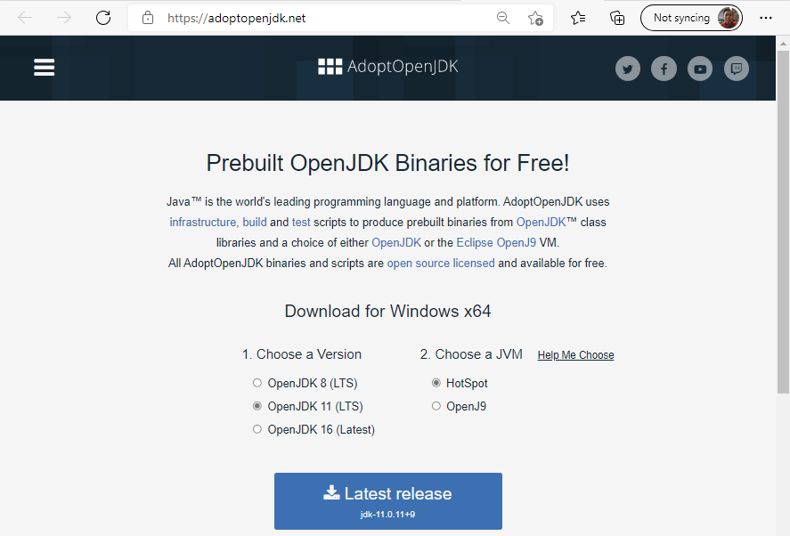
>
> - Begin the installation process.
> 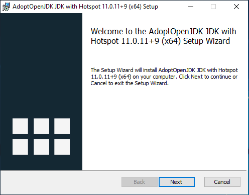
>
> - Review and check the acceptance of the GNU License
> 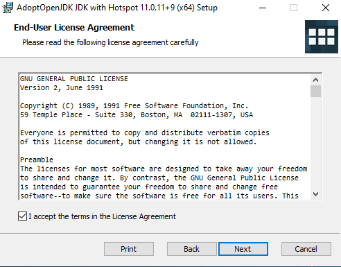
>
> - Confirm the select components match as shown in the screenshot below:
> 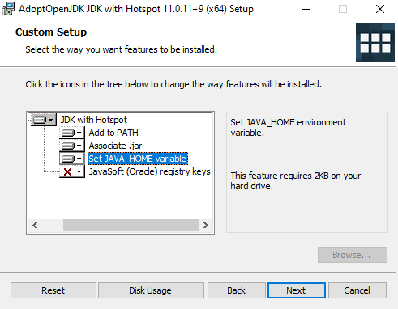
>
> - Start the installation.
> 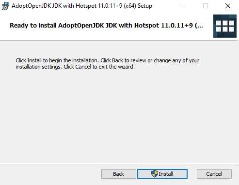
>
> - Check the installation progress. 
> 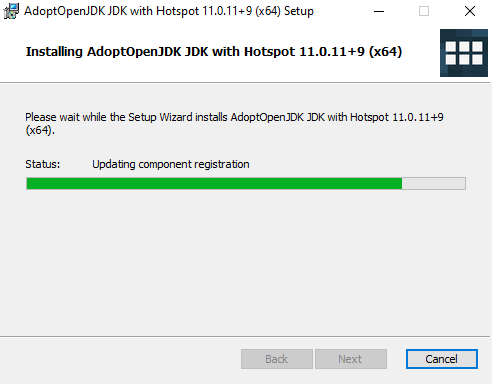
>
> - Click `Finish` to complete the installation.
> 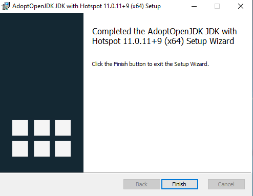
>
> - We can validate this installation via the terminal in VSCode, 
>   - Open a new terminal in VSCode or relaunch VSCode. 
> - Run the following command:
> 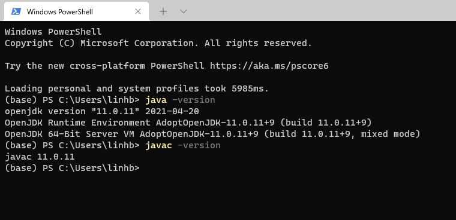
>
{:.slide}

> ## 6. Install Maven (Windows)
> 
> > ## Mac and Linux:
> > - For Mac, you can use `Homebrew` to install maven: https://formulae.brew.sh/formula/maven
> > - For Linux, depending on your distros, you can use `yum`/`dnf`/`apt-get` to install `maven`. 
> {:.checklist}
>
> - Go to [Apache Maven's Project Page](https://maven.apache.org/download.cgi) and download the appropriate
> version of Maven. 
>   - If you use Windows, download [apache-maven-3.8.1-bin.zip](https://downloads.apache.org/maven/maven-3/3.8.1/binaries/apache-maven-3.8.1-bin.zip)
>   - If you use Mac/Linux, download [apache-maven-3.8.1-bin.tar.gz]https://downloads.apache.org/maven/maven-3/3.8.1/binaries/apache-maven-3.8.1-bin.tar.gz) 
> - Unzip the dowloaded files. 
> - For Windows, unzip the downloaded file into your `C:` drive. 
>
> 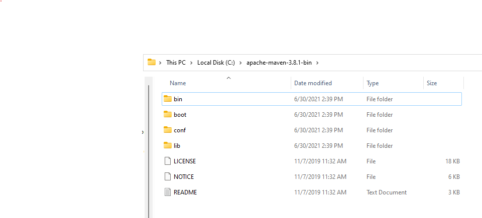
>
> - In the VS terminal, run the following command:
>  
> ~~~
> $ setx path "%path%;c:\apache-maven-3.8.1-bin\bin"
> ~~~
> {: .language-bash}
>

{:.slide}


