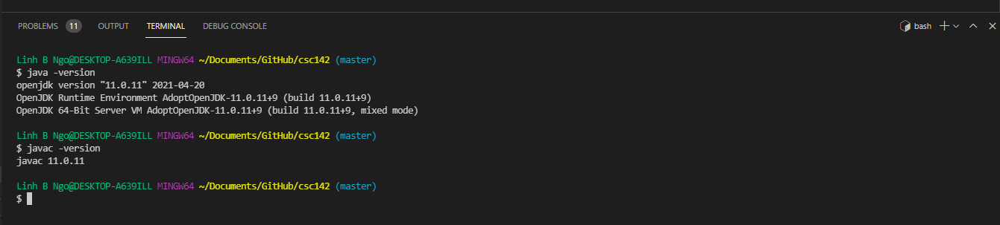

> ## To do
> 
> This course requires access to a computing environment that:
>
> - Support Git/GitHub (version control system). 
> - Support Java 11. 
> - Support Apache Maven 3+ (a software project management and comprehension tool). 
>
> In the remainder of this page, instructions will be provided for setting up your 
> own computing environment in Windows and Macs.
> 
{: .checklist}

> ## 1. Create a GitHub account
> 
> Regardless of your computing environment, a GitHub account is required for this 
> course. 
> 
> - If you don't have an existing GitHub account, go to 
> [GitHub's Page](https://github.com/) and register for an account with your WCUPA 
> email address. 
> - If you already have an existing GitHub account, go ahead and add your WCUPA email 
> address to your GitHub account as a secondary email. 
>
{: .slide}

> ## 2. Install VSCode
>
> Go to [Visual Studio Code's download page][vscode] and download the correct package for your computer (Windows, Mac OS, or Linux). 
For Windows, you can download `User Installer 64-bit` version if you only want to install VSCode into your user account. 
> 
> 
> 
> 
> 
> 
> 
> 
> 
{:.slide}

> ## 3. Install Git
>
> - Go to [Git's download page](https://git-scm.com/downloads) and select the appropriate download
> for your operating system. 
> - The remainder of this slide uses Windows as a demonstration, but the Mac's installation steps 
> will be similar. 
> - Double-click on the downloaded file to launch the installer. 
> - Read through the GNU Public License and click Next
> 
>
> - Review the default installation location and click Next
> 
>
> - Confirm the select components match as shown in the screenshot below:
> 
> 
> 
> 
> 
> 
> 
> 
> 
> 
> 
> 
> 
> 
> 
> 
{:.slide}

> ## 4. Install Java
>
> 
> 
> 
> 
> 
> 
> 
> 
>
{:.slide}
It is most likely that you already have Java installed. To confirm this, first,
open a terminal in VSCode by select **Terminal/New Terminal** on the top Menu bar. 

Next, run `javac -version`

~~~
$ javac -version
~~~
{: .language-bash}

You see the version of Java being displayed on screen. Your version might be
different from mine.

 ~~~
javac 1.8.0_222
 ~~~
 {: .output}

Next, run `java -version`.

~~~
$ java -version
~~~
{: .language-bash}

Similarly, version information will be displayed.

~~~
openjdk version "1.8.0_222"
OpenJDK Runtime Environment (AdoptOpenJDK)(build 1.8.0_222-b10)
OpenJDK 64-Bit Server VM (AdoptOpenJDK)(build 25.222-b10, mixed mode)
~~~
{: .output}

If you do not have **both** `java` and `javac`, you will need to install Java
SDK (Software Development Kit). We will be using the Java distribution maintained
by OpenJDK.

- Go to [OpenJDK website](https://adoptopenjdk.net).
- Choose **OpenJDK 8 (LTS)** for Version and **HotSpot** for JVM.
- Click on the download link to begin download the installation package.
- Run the installer. You can keep all default settings on the installer.
- Once the installation process finishes, carry out the tests *in a ner terminal* above to confirm
that you have both `java` and `javac`.

## Installation of Gradle

Follows the installation steps described in [Gradle's documentation page](https://docs.gradle.org/current/userguide/installation.html) to install and setup gradle. 

## Setup GitHub account
- If you don't already have a GitHub account, go to [GitHub web page][github] to sign up for an account. 
- It should be noted that you can link multiple email addresses to a GitHub account. Even if you already have a 
GitHub account, you might want to link the account to your WCUPA email. 


